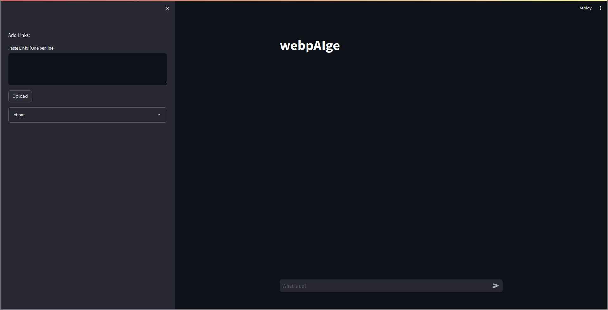

<div align="center">
<h3>webpAIge</h3>
<p align="center"> Chat with webpages </p>
</div>

<details>
  <summary>Contents</summary>
	<ol>
	<li>
 	<a href="#about">About</a>
  	</li>
	<li>
	<a href="#demo">Demo</a>
	</li>
        <li>
        <a href="#prerequisites">Prerequisites</a>
        </li>
        <li>
        <a href="#installation">Installation</a>
        </li>
        <li>
        <a href="#running">Running</a>
		<ul>
		<li>
			<a href="#starting-the-pathway-backend">Starting pathway backend</a>
		</li>
                <li>
                        <a href="#starting-the-streamlit-ui">Starting Streamlit UI</a>
                </li>		
		<ul>
        </li>
  </ol>
</details>


## About

webpAIge unlocks real-time conversations with webpages. Powered by the Pathways framework, it gathers content in real-time, and then uses the Gemini AI model for chat completion.
Here is the architecture diagram of how it works .


## Demo

Click to see the demo

[](https://www.youtube.com/watch?v=-CwuSbPkDtA)

## Prerequisites
If you have windows follow the steps given below ( if you have linux ignore these steps) :

- Go to powershell in run as administrator
 	
- Type wsl --install

- Go to the  desired location using << cd /mnt/c/desired location >>

- Follow the steps as given in installation
  	
1. Install [conda](https://docs.conda.io/projects/conda/en/stable/)
2. Create an [Gemini API Key](https://ai.google.dev/) 

    Then, follow the easy steps to install and get started using the app.

## Installation

1. Clone the repo
    ```sh
    git clone https://github.com/mutualite/pathway.git
    ```

2. Create a conda environment using environment.yml file 
    ```sh
    conda env create -f environment.yml
    ```

3. Activate the environment using the command
    ```sh
    conda activate webpAIge_env
    ```

3. Create a .env file with following content
    ```env
    GEMINI_API_TOKEN= {YOUR_API_TOKEN}
    EMBEDDER_LOCATOR=models/text-embedding-004
    EMBEDDING_DIMENSION=768
    MODEL_LOCATOR=gemini/gemini-pro
    MAX_TOKENS=8000
    TEMPERATURE=0.0
    HOST="localhost"

4. Install packages
    ```sh
    pip install --upgrade -r requirements.txt
    ```
## Running

### Starting the pathway backend
1. Go to the directory with the main.py file
2. Run the command
    ```sh
    python main.py
    ```
### Starting the streamlit ui
1. Go to the ui directory
2. Run the command
    ```sh
     streamlit run ui.py
    ```

